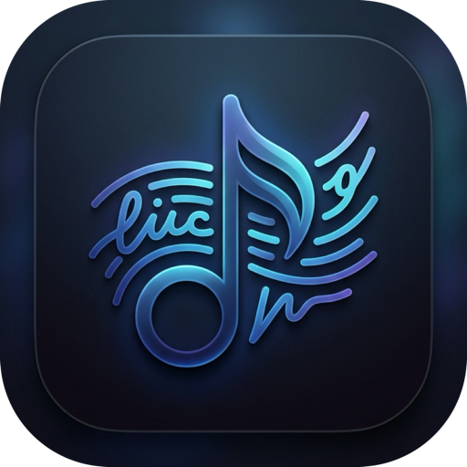

# ezlyrics 🎵



A simple, floating lyrics widget for macOS. It detects what you're playing (Spotify, Apple Music, Safari, Chrome, etc.), grabs the synced lyrics, and displays them as an overlay on your screen.

## Features
- **Auto-detection**: Just play a song. No manual search needed.
- **Draggable & Customizable**: Put the widget anywhere. Tweak fonts, sizes, colors, and layouts from the menu bar icon.
- **Karaoke Sync**: Real-time line-by-line lyric tracking with a smooth karaoke-style wipe effect.
- **Auto-Romanization**: Automatically detects non-Latin lyrics (Japanese, Korean, Chinese, Cyrillic, etc.) and converts them to Latin script (Romaji, Pinyin, etc.) so you can easily sing along.
- **Native Translation**: Uses macOS 15+ built-in neural translation to intelligently translate lyrics on the fly.
- **Manual Overrides**: If the auto-sync is slightly off or grabs the wrong song, use the menu bar to adjust the timing offset with precision `+/- 100ms` steppers, track the active line via the auto-scrolling list, or search manually.

## Installation

### Option 1: Download Release
Since this app uses a private macOS framework (`MediaRemote`) to read what's playing without requiring complex accessibility permissions, it isn't signed for the App Store.

1. Download `ezlyrics.app.zip` from the [Releases](../../releases) page.
2. Unzip and drag `ezlyrics.app` to your Applications folder.
3. Because it's unsigned, you'll need to bypass Gatekeeper. Run this in Terminal:
   ```bash
   xattr -cr /Applications/ezlyrics.app
   ```
4. Open the app!

### Option 2: Build from Source
If you prefer to compile it yourself:

1. Clone the repo:
   ```bash
   git clone https://github.com/RychEmrycho/ezlyrics.git
   cd ezlyrics
   ```
2. Run the install script to compile and move it to your `~/Applications` folder:
   ```bash
   chmod +x install.sh
   ./install.sh
   ```

## License
Open-sourced under the GPLv3 License.
