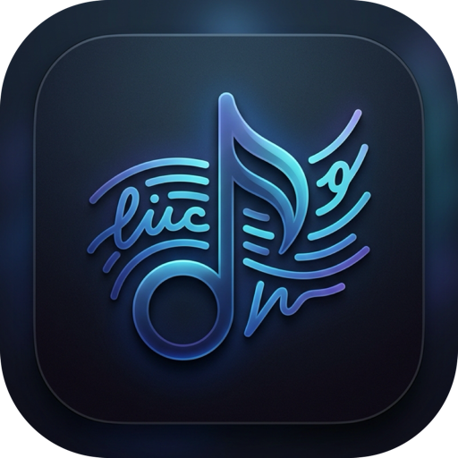
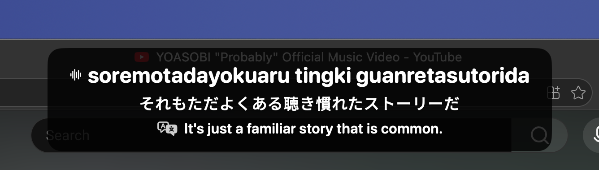
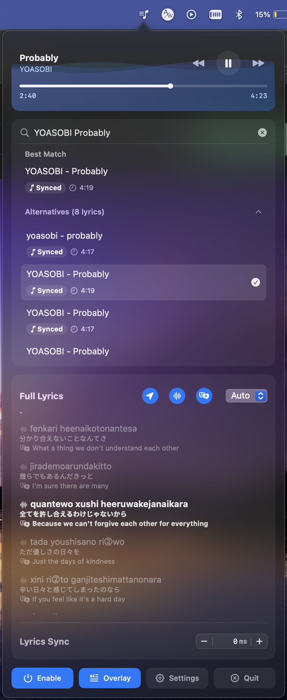
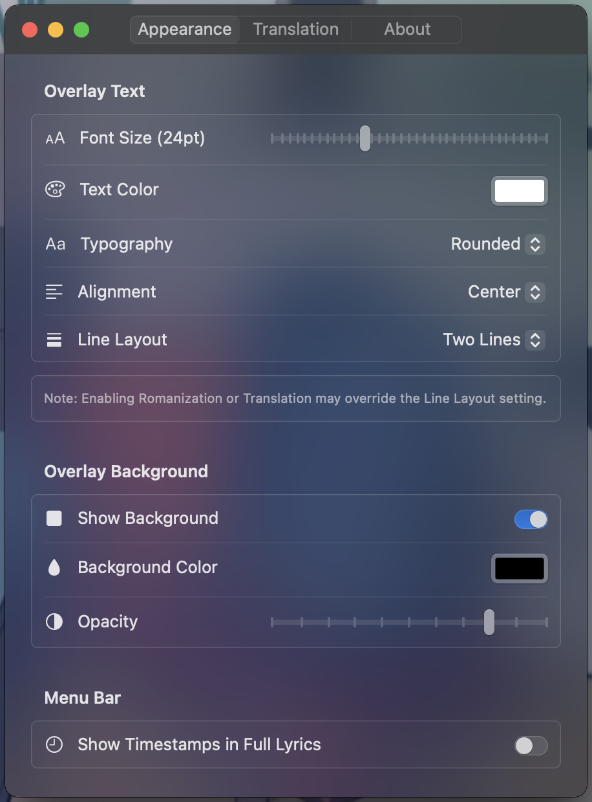
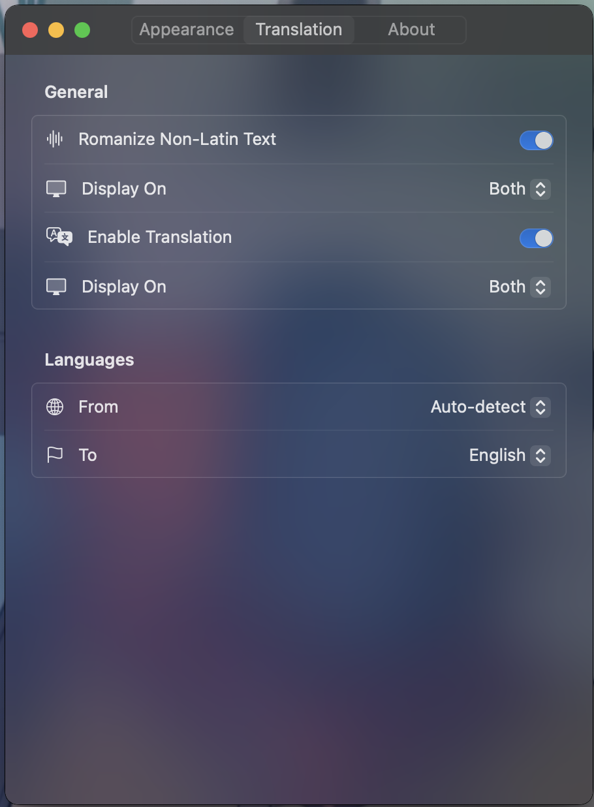
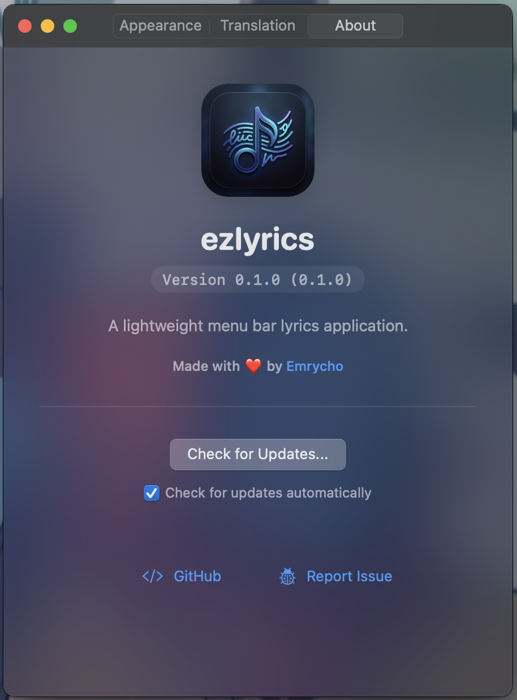

# ezlyrics 🎵

<p align="center">
  
</p>

A simple, floating lyrics widget for macOS. It detects what you're playing (Spotify, Apple Music, Safari, Chrome, etc.), grabs the lyrics, and displays them as an overlay on your screen.

## ✨ Features

- **Auto-detection**: Just play a song. No manual search needed.
- **Karaoke Sync**: Real-time line-by-line lyric tracking with a smooth karaoke-style wipe effect.
- **Draggable & Customizable**: Put the widget anywhere (it remembers its position!). Tweak fonts, sizes, text/background colors, and layouts from a dedicated Settings window.
- **Native Translation**: Uses macOS 15+ built-in neural translation to intelligently translate lyrics on the fly. Configure translations to appear on the floating overlay, the full lyrics menu, or both.
- **Auto-Romanization**: Automatically detects non-Latin lyrics (Japanese, Korean, Chinese, Cyrillic, etc.) and converts them to Latin script (Romaji, Pinyin, etc.) so you can easily sing along.
- **Smart Overlay Auto-Hide**: The floating lyrics widget intelligently auto-hides if the current song has no lyrics available or is an instrumental, fading out unobtrusively after 3 seconds. 
- **Manual Overrides**: If the auto-sync is slightly off or grabs the wrong song, use the menu bar to adjust the timing offset with precision `+/- 100ms` steppers, track the active line (and its exact timestamp) via the auto-scrolling Full Lyrics view, or search manually.
- **Plain Lyrics Auto-Scroller**: Got a song with only plain text lyrics? No problem! Toggle the auto-scroller in the menu bar and adjust the speed to smoothly scroll through plain lyrics line-by-line while you read along.
- **Automatic Updates**: ezlyrics can automatically check for new releases on GitHub, so you're always running the latest version.
- **Kill Switch & Quick Menu**: Right-click the menu bar icon for a quick-access context menu. Need to save battery? Use the kill switch to completely disable background tracking without quitting the app.

## 📋 Requirements

- **To run the app**: **macOS 14.0 (Sonoma)** or later.
- **To build from source**: **macOS 14.5** or later (required to install Xcode 16).
- *Note: The Native Translation feature requires **macOS 15.0 (Sequoia)** or later.*

## 🚀 Installation

### Option 1: Download Release (Recommended)

Since this app uses a private macOS framework (`MediaRemote`) to read what's playing without requiring complex accessibility permissions, it isn't signed for the App Store.

1. Download the latest `ezlyrics-vX.X.X.dmg` from the [Releases](../../releases) page.
2. Double-click to mount the DMG, then drag `ezlyrics.app` to your Applications folder.
3. Because it's unsigned, you'll need to bypass Gatekeeper. Open your Terminal and run:
   ```bash
   xattr -cr /Applications/ezlyrics.app
   ```
4. Open the app!

### Option 2: Build from Source

To compile the app yourself, you will need **Xcode 16** (or later) or the corresponding **Command Line Tools**. This is required because the project relies on the Swift 6 compiler and the new `Translation` framework introduced in the macOS 15 SDK. *(Note: Xcode 16 can be installed on macOS Sonoma 14.5 or later).*

1. Clone the repo:
   ```bash
   git clone https://github.com/RychEmrycho/ezlyrics.git
   cd ezlyrics
   ```
2. Run `make install` to compile and install the app to your `/Applications` folder:
   ```bash
   make install
   ```
3. To remove the development app, run:
   ```bash
   make uninstall
   ```

## 🖼️ Gallery

### 🎤 Floating Lyrics Overlay


### 🎛️ Menu Bar & Controls


### ⚙️ Settings
<p>
  
  &nbsp;&nbsp;
  
  &nbsp;&nbsp;
  
</p>

## 📄 License

Open-sourced under the GPLv3 License.
